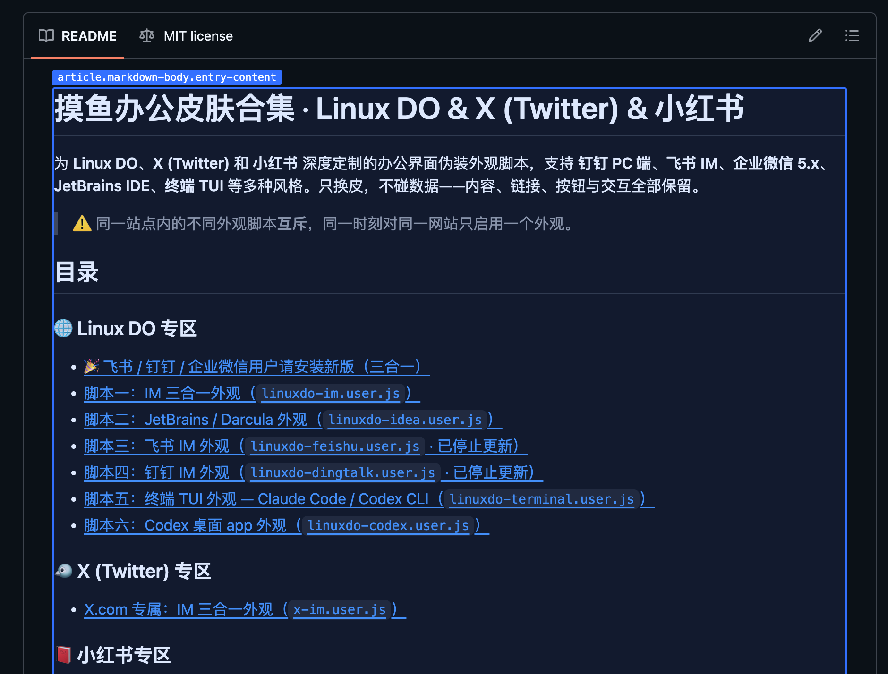
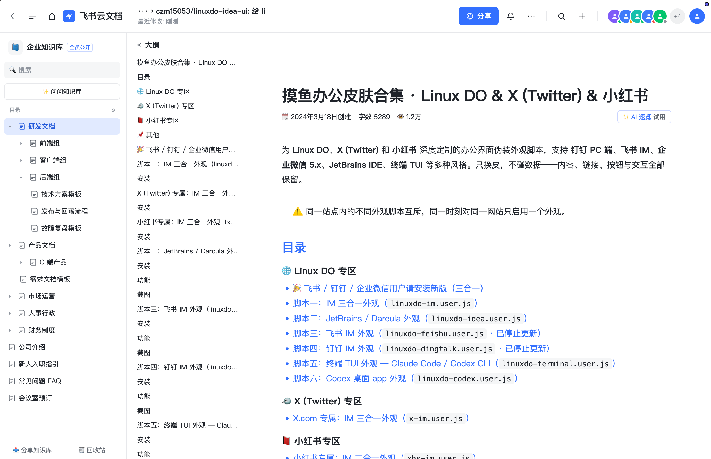
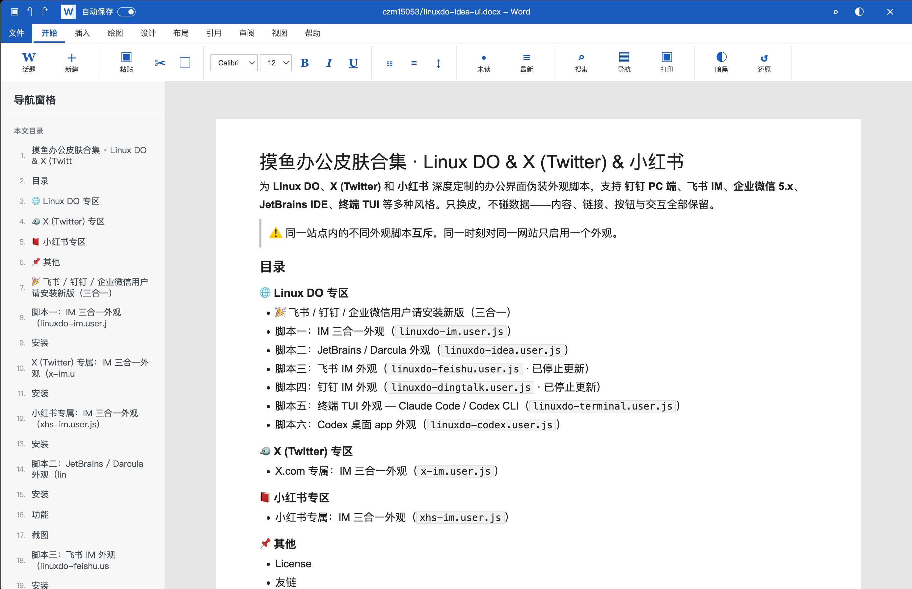

# 摸鱼办公皮肤合集 · Linux DO & X (Twitter) & 小红书

为 **Linux DO**、**X (Twitter)** 和 **小红书** 深度定制的办公界面伪装外观脚本，支持 **钉钉 PC 端**、**飞书 IM**、**企业微信 5.x**、**JetBrains IDE**、**终端 TUI** 等多种风格。只换皮，不碰数据——内容、链接、按钮与交互全部保留。

> ⚠️ 同一站点内的不同外观脚本**互斥**，同一时刻对同一网站只启用一个外观。

## 目录

### 🌐 Linux DO 专区
- [🎉 飞书 / 钉钉 / 企业微信用户请安装新版（三合一）](#-飞书--钉钉--企业微信用户请安装新版三合一)
- [脚本一：IM 三合一外观（`linuxdo-im.user.js`）](#脚本一im-三合一外观linuxdo-imuserjs)
- [脚本二：JetBrains / Darcula 外观（`linuxdo-idea.user.js`）](#脚本二jetbrains--darcula-外观linuxdo-ideauserjs)
- [脚本三：飞书 IM 外观（`linuxdo-feishu.user.js` · 已停止更新）](#脚本三飞书-im-外观linuxdo-feishuuserjs)
- [脚本四：钉钉 IM 外观（`linuxdo-dingtalk.user.js` · 已停止更新）](#脚本四钉钉-im-外观linuxdo-dingtalkuserjs)
- [脚本五：终端 TUI 外观 — Claude Code / Codex CLI（`linuxdo-terminal.user.js`）](#脚本五终端-tui-外观--claude-code--codex-clilinuxdo-terminaluserjs)
- [脚本六：Codex 桌面 app 外观（`linuxdo-codex.user.js`）](#脚本六codex-桌面-app-外观linuxdo-codexuserjs)

### 🐦 X (Twitter) 专区
- [X.com 专属：IM 三合一外观（`x-im.user.js`）](#x-twitter-专属im-三合一外观x-imuserjs)

### 📕 小红书专区
- [小红书专属：IM 三合一外观（`xhs-im.user.js`）](#小红书专属im-三合一外观xhs-imuserjs)

### ✨ 通用工具
- [文章一键伪装（`doc-select.user.js` · 全网站通用）](#文章一键伪装doc-selectuserjs--全网站通用)

### 📌 其他
- [License](#license)
- [友链](#友链)

# 🎉 飞书 / 钉钉 / 企业微信用户请安装新版（三合一）

<center>

**飞书、钉钉、企业微信三款皮肤已合并为一套「IM 三合一」脚本（`linuxdo-im.user.js`），功能更强、更新更及时。**  
旧的独立飞书 / 钉钉脚本已停止更新，**请改用新版** 👇

</center>

## 脚本一：IM 三合一外观（`linuxdo-im.user.js`）

一套脚本内置 **钉钉 / 飞书 / 企业微信** 三套 IM 皮肤，一键切换。附带完整互动内核：投票、小火箭、图片灯箱、引用跳转、全局搜索（⌘/Ctrl+K）、用户卡片、原生编辑器原地嵌入、实时刷新。

### 安装

1. 安装 [Tampermonkey](https://www.tampermonkey.net/)（或 Violentmonkey）
2. 打开 [`linuxdo-im.user.js`](./linuxdo-im.user.js)，点 **Raw** 后安装
3. 访问 <https://linux.do/>；脚本更新后请硬刷新一次

Raw 直链（仓库公开后可用）：

```text
https://github.com/czm15053/linuxdo-idea-ui/raw/main/linuxdo-im.user.js
```

功能详解、截图与开发说明详见 [`im/README.md`](./im/README.md)。

## X (Twitter) 专属：IM 三合一外观（`x-im.user.js`）

为 [x.com](https://x.com/) / [twitter.com](https://twitter.com/) 深度定制的办公 IM 伪装脚本。将主页推荐流、关注、私信伪装为 **钉钉 / 飞书 / 企业微信** 聊天界面，支持 GraphQL 详情抽屉、原版 1:1 矢量图标、原生安全发帖与防窥脱敏。

### 安装

1. 安装 [Tampermonkey](https://www.tampermonkey.net/)
2. 打开 [`x/x-im.user.js`](./x/x-im.user.js)，点 **Raw** 后安装
3. 访问 <https://x.com/> 自动生效

Raw 直链（仓库公开后可用）：

```text
https://github.com/czm15053/linuxdo-idea-ui/raw/main/x/x-im.user.js
```

完整架构、效果截图占位与开发说明详见 [`x/README.md`](./x/README.md)。

## 小红书专属：IM 三合一外观（`xhs-im.user.js`）

为 [xiaohongshu.com](https://www.xiaohongshu.com/) 深度定制的办公 IM 伪装脚本。将发现推荐流伪装为 **钉钉 / 飞书 / 企业微信** 聊天界面，笔记以聊天气泡呈现，支持详情抽屉与多级评论树、点赞/收藏/关注原生代理、触底自动加载与防窥脱敏。

### 安装

1. 安装 [Tampermonkey](https://www.tampermonkey.net/)（或 Violentmonkey）
2. 打开 [`xhs/xhs-im.user.js`](./xhs/xhs-im.user.js)，点 **Raw** 后安装
3. 访问 <https://www.xiaohongshu.com/> 自动生效（初次安装后请硬刷新一次）

Raw 直链（仓库公开后可用）：

```text
https://github.com/czm15053/linuxdo-idea-ui/raw/main/xhs/xhs-im.user.js
```

完整功能说明与开发构建详见 [`xhs/README.md`](./xhs/README.md)。

## 文章一键伪装（`doc-select.user.js` · 全网站通用）

**不限站点的整页文档化脚本**（视觉灵感来自 [linuxdo-lark-ui](https://github.com/starwingcc/linuxdo-lark-ui) 与 [discourse-word-ui](https://github.com/gbxhq/discourse-word-ui)）：按 **⌘+'（mac）/ Ctrl+'（windows）** 圈选页面正文元素，悬停高亮、点击选中，选择**飞书文档**或 **Word 文档**——整页立刻切换为对应文档视图：**选中元素成为居中的白色文档页**（文档排版全套：字体/标题/链接/代码/引用/表格），**其余元素全部隐藏**，飞书为浅灰工作区、Word 为灰色工作区。纯视觉、不改数据，**刷新即还原**。

### 安装

1. 安装 [Tampermonkey](https://www.tampermonkey.net/)（或 Violentmonkey）
2. 打开 [`doc-select.user.js`](./doc-select.user.js)，点 **Raw** 后安装
3. 在任意网页按 **⌘/Ctrl+'**，点击正文区域，再选飞书或 Word

Raw 直链（仓库公开后可用）：

```text
https://github.com/czm15053/linuxdo-idea-ui/raw/main/doc-select.user.js
```

### 功能

- **快捷键圈选正文**：⌘/Ctrl+' 进入/退出，进入后顶部显示操作提示，悬停显示蓝色高亮框与元素提示，点击从内联元素自动上溯到块级容器；Esc 取消
- **整页文档视图**：选中元素化为居中白色文档页（max-width 900px），页内标题/段落/链接/代码/引用/列表/表格/图片全套文档排版
- **飞书文档**（token 对齐 linuxdo-lark-ui）：#F5F6F7 工作区 + 8px 圆角文档卡片（980px）+ 飞书字体与 #3370FF 蓝色链接 + **64px 顶栏**（「飞书云文档」品牌 + 面包屑与真实字数 + 假图标组/头像组/分享按钮）+ **250px 左侧导航栏**（新建/我的文档/共享空间/知识库/收藏/回收站 + 最近浏览，内容编排）+ **右侧大纲面板**
- **Word 文档**（token 对齐 discourse-word-ui）：#E5E5E5 画布 + 980px 直角纸张页（`0 1px 4px` 轻投影）+ Segoe UI/Calibri + **蓝色标题栏**（#185ABD，快速访问 ▣↶↷ + W 标 + 自动保存开关 + 居中"标题.docx - Word"）+ **功能区**（文件/开始/插入/绘图/设计/布局/引用/审阅/视图/帮助 tab，Georgia 蓝色字符图标命令组）+ **250px 导航窗格**（编号章节 + 真实大纲）
- **正文大纲**（真实功能）：从圈选正文自动提取 h1-h4 生成大纲，两个主题下都可点击跳转到对应标题；链接色、纸张宽度、投影均与参考项目一致
- **一键返回原网页**：飞书顶栏「←」、Word 标题栏/功能区「↺ 还原」随时整页还原（皮肤、隐藏、外框全部撤销）
- **正文排版对齐**：Word 16px/1.72、飞书 16px/1.8（参考项目 .cooked 实测值），纸张内边距 Word 48/66/74、飞书 40/48；飞书为白画布全通栏文档页、一级标题飞书蓝、bullet 蓝点、灰底 callout 引用块（按真实飞书云文档截图校准）
- **Word 暗色模式**（对齐 dw-dark-mode）：标题栏 ◐ 或功能区「暗黑」按钮切换，画布 #1E2023、纸张 #25272B、全套 token 同步，偏好记忆

### 截图

| | |
| --- | --- |
| 圈选模式（⌘/Ctrl+'） |  |
| 主题选择 |  |
| 飞书云文档视图 |  |
| Word 文档视图 |  |
- **其余元素全部隐藏**（头部/侧边栏/页脚/悬浮层）；主题卡片保持打开，点另一个主题即时切换，点当前主题**整页还原**
- 输入框、编辑器内按快捷键不触发；严格 CSP 站点（GitHub 等）照常生效

## 脚本二：JetBrains / Darcula 外观（`linuxdo-idea.user.js`）

换成 **JetBrains IDE / Darcula** 风格。

### 安装

1. 安装 [Tampermonkey](https://www.tampermonkey.net/)（或 Violentmonkey）
2. 打开 [`linuxdo-idea.user.js`](./linuxdo-idea.user.js)，点 **Raw** 后安装
3. 访问 <https://linux.do/>；脚本更新后请硬刷新一次

Raw 直链（仓库公开后可用）：

```text
https://github.com/czm15053/linuxdo-idea-ui/raw/main/linuxdo-idea.user.js
```

### 功能

- **IDEA / PyCharm 切换**：点击顶栏品牌标，选择写入 `localStorage`
- **主页**：话题列表伪装为 **Git Log**（多泳道 SVG 图谱）
- **话题页**：帖子渲染为代码编辑器阅读区（随产品切换 Java / Python 风）
- **回帖**：混合语句模板；过短的回帖会补少量样板行
- **代码行内图片**：默认收起，悬停预览，点击固定
- **侧栏**：Project View 风格（路径栏、黄文件夹、箭头与选中色）
- **工具窗条**：左右两侧 IDE 风格条带（Project / Commit / Maven / Python 等装饰按钮，窄屏自动隐藏）
- **加载页面 / favicon / 菜单**：偏 IDE 壳层；通知区接近 Event Log
- **颜色模式**：跟随 linux.do 浅色 / 深色 / 自动；深色对齐 Darcula
- **SPA**：站内跳转与前进后退后自动重新套用样式

### 截图

| | |
| --- | --- |
| 闪屏 |  |
| 主页 Git Log |  |
| 话题 · IDEA |  |
| 话题 · PyCharm |  |
| Hover 链接显示图片 |  |

## 脚本三：飞书 IM 外观（`linuxdo-feishu.user.js`）

换成**飞书即时消息**风格，无顶栏、三栏主从同屏。

### 安装

同上，安装 [`linuxdo-feishu.user.js`](./linuxdo-feishu.user.js) 即可。

Raw 直链（仓库公开后可用）：

```text
https://github.com/czm15053/linuxdo-idea-ui/raw/main/linuxdo-feishu.user.js
```

### 功能

- **左一 rail**：像素级复刻飞书文字导航；仅右上角圆圈按钮可用，用于展开 / 收起大类
- **左二展开栏**：站点原生侧栏原样搬入，内容、文案、未读标记完全跟随原网页
- **中栏**：帖子会话列表，支持最新 / 新帖 / 未读 / 热门 / 分类 / 标签路由
- **右栏**：帖子详情聊天区，点击中栏帖子就地渲染聊天气泡，底部接原生回复框可同屏回帖
- **原生视图切换**：右栏右上角可随时切回原版界面，选择会记住
- **隐私头像切换**：中栏标题栏一键把真实头像替换成文字 / 图标伪装；开启后会话标题改为随机工作关联名，真标题下沉到最近消息行，状态会记住
- **窄屏适配**：宽度 < 1000px 时自动单栏，列表与详情二选一显示
- **深色模式**：左栏底部「深色 / 浅色」切换；偏好写入 `localStorage`，开启时强制站点深色，关闭时强制站点浅色

### 截图

| | |
| --- | --- |
| 帖子详情 |  |
| 个人视角 |  |
| 点击展开分类列表 |  |
| 点击下拉筛选 |  |
| hover 头像通知 |  |
| 一键切换隐私头像 |  |

## 脚本四：钉钉 IM 外观（`linuxdo-dingtalk.user.js`）

换成**新版钉钉 PC 即时消息**风格：蓝紫渐变顶栏 + 110px 图标文字导航 + 会话列表 + 聊天区。

### 安装

同上，安装 [`linuxdo-dingtalk.user.js`](./linuxdo-dingtalk.user.js) 即可。

Raw 直链（仓库公开后可用）：

```text
https://github.com/czm15053/linuxdo-idea-ui/raw/main/linuxdo-dingtalk.user.js
```

### 功能

- **titlebar**：左侧用户头像（hover / 点击打开通知菜单，带未读角标）、居中搜索条（同步原生搜索）、右侧深色模式切换 + 投屏 / 创建装饰按钮
- **左 rail**：浅色图标 + 文字横向导航（消息 / 文档 / AI表格 / AI听记 / 工作台 / 通讯录 / 会议 / 日历 / 待办 / 添加），顶部组织 chip；底部「更多」展开 / 收起原生侧栏，宽度可拖拽
- **中栏**：会话列表（消息 / 未读 chips 带计数 + 筛选）；圆角矩形头像；支持一键切换为单字 / 九宫格伪装头像（同时用随机工作标题替换真标题，真标题下沉到最近消息行）
- **右栏**：聊天头带参与人数与所属分类 chip；话题聊天气泡 + 底部卡片式 composer（点击打开原生编辑器）
- **原生视图切换**：聊天区可切回原版界面，选择会记住
- **深色模式**：顶栏月亮 / 太阳按钮切换；偏好写入 `localStorage`，开启时强制站点深色，关闭时强制站点浅色
- **互斥**：检测到 IDEA 或飞书主题时自动避让

### 截图

| | |
| --- | --- |
| 帖子详情 |  |
| 个人视角 |  |
| 点击展开分类列表 |  |
| 点击下拉筛选 |  |
| hover 头像通知 |  |
| 一键切换隐私头像 |  |

## 脚本五：终端 TUI 外观 — Claude Code / Codex CLI（`linuxdo-terminal.user.js`）

把 LinuxDo 伪装成 **Claude Code** 或 **OpenAI Codex CLI** 的终端会话界面，黑底等宽字体、命令行式交互。

### 安装

同上，安装 [`linuxdo-terminal.user.js`](./linuxdo-terminal.user.js) 即可。

Raw 直链（仓库公开后可用）：

```text
https://github.com/czm15053/linuxdo-idea-ui/raw/main/linuxdo-terminal.user.js
```

### 功能

- **双配色一键切换**：标题栏 `Claude` / `Codex` 两个 tab 切换；Claude Code 采用紫/薰衣草高亮，Codex CLI 采用蓝/琥珀高亮，偏好写入 `localStorage`
- **终端窗口外壳**：mac 显示红绿灯，Windows 显示最小化/最大化/关闭按钮；标签页标题固定为 `linux.do — zsh/pwsh`，不暴露真实帖子标题
- **启动画面**：列表页顶部仿真实 CLI 启动信息
  - Claude：版本盒、Tips、What's new、awaiting/working/completed 计数
  - Codex：directory / permissions / model 信息行 + 每日轮换 Tip
- **话题列表**：渲染为终端会话列表，显示已读/未读圆点、置顶标、回复数；底部提示真实快捷键
- **话题详情**：帖子渲染为 assistant turn，含折叠式 thinking 块、假工具调用、真实帖子内容；支持上下滚动加载更多楼层
- **底部 composer**：`Enter` 发送、`Shift+Enter` 换行、`Esc` 清除；API 发送失败后自动 fallback 到原生编辑器；可回复指定楼层
- **分类浮层**：点击面包屑分类或按 `/` 唤出 Select 浮层，左列选分类、右列选视图（最新 / 新帖 / 未读 / 热门 / 排行榜），支持键盘导航与 filter 输入
- **键盘快捷键**：按 `?` 查看完整快捷键；主要包含
  - 全局：`⌘/Ctrl+K` 搜索，`/` 分类，`Esc` 返回/关闭
  - 列表页：`↑/k ↓/j` 移动，`←/h →/l` 切换视图，`↵` 打开
  - 详情页：`j/k` 滚动，`r` 回复，`l` 点赞，`c` 复制链接
- **原生视图切换**：状态栏 `native` 可切回原版 Discourse 界面，选择会记住
- **未读通知**：状态栏每分钟刷新未读通知数
- **互斥**：检测到 IDEA、飞书、钉钉或其他 codex 主题时自动避让

### 截图

| | |
| --- | --- |
| Claude Code 列表页 |  |
| Claude Code 详情页 |  |
| Codex 列表页 |  |
| Codex 详情页 |  |
| 分类选择浮层 |  |

## 脚本六：Codex 桌面 app 外观（`linuxdo-codex.user.js`）

换成 **OpenAI Codex 桌面 app** 风格：左侧导航 rail + 中间线程列表 / 详情 + 右侧氛围代码面板，配色实测自原版 app 截图，明暗双模式。

### 安装

同上，安装 [`linuxdo-codex.user.js`](./linuxdo-codex.user.js) 即可。

Raw 直链（仓库公开后可用）：

```text
https://github.com/czm15053/linuxdo-idea-ui/raw/main/linuxdo-codex.user.js
```

### 功能

- **左 rail**：Codex 品牌标 + 搜索 / 通知入口；话题、我的草稿、我的消息、徽章、私聊机器人、近期活动、更多；下方分类树可逐级展开 / 收起并显示未读，底部收养原生用户菜单（当前用户名 + 明暗切换）
- **列表页**：话题渲染为 Codex 项目线程列表，点击就地进入详情
- **详情页**：帖子渲染为 agent thread（楼层带 "Worked for xx" 装饰），引用可跳源楼并一键返回；投票、书签、点赞等原生交互完整保留
- **右侧代码面板**：纯氛围分屏，模拟 IDE 打开源码文件，可关闭；三栏宽度均可拖拽调整
- **明暗双模式**：默认跟随 linux.do 配色，左下角按钮可手动覆盖，偏好写入 `localStorage`
- **加载页面 / favicon**：OpenAI 花朵加载动画，favicon 换成圆角底 OpenAI 花
- **图片灯箱**：点击放大防出屏；composer 支持粘贴 / 拖拽图片上传
- **CF 盾兼容**：检测到 Cloudflare 盾页时自动降级为原生界面
- **互斥**：检测到其他皮肤脚本时自动避让；SPA 站内跳转后自动重新套用

### 截图

| | |
| --- | --- |
| 加载页面 |  |
| 列表页 · 收起侧边栏 |  |
| 列表页 · 展开侧边栏 |  |
| 详情页 · 收起侧边栏 |  |
| 详情页 · 展开侧边栏 |  |

## License

MIT © czm15053

JetBrains、IntelliJ IDEA、PyCharm 均为 JetBrains s.r.o. 商标；飞书为字节跳动旗下产品商标；钉钉为阿里巴巴集团产品商标；Codex、OpenAI 为 OpenAI 商标；小红书为行吟信息科技（上海）有限公司产品商标。本项目为非官方、非关联作品。

## 友链

- [linux.do](https://linux.do/)
